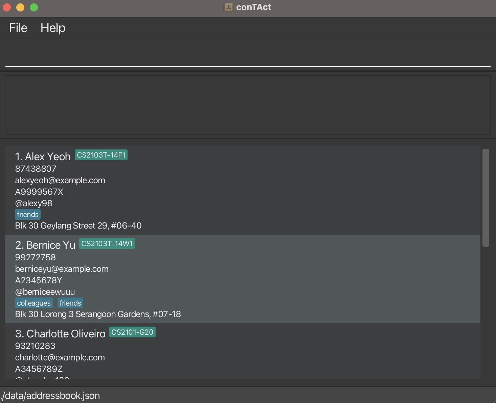

* This is **a sample project for Software Engineering (SE) students**. 
  Example usages:
  * as a starting point of a course project (as opposed to writing everything from scratch)
  * as a case study
* The project simulates an ongoing software project for a desktop application (called _CollabSync_) used for managing contact details.
  * It is **written in OOP fashion**. It provides a **reasonably well-written** code base **bigger** (around 6 KLoC) than what students usually write in beginner-level SE modules, without being overwhelmingly big.
  * It comes with a **reasonable level of user and developer documentation**.
* It is named `CollabSync` but it was initially created as a part of a series of `AddressBook` projects (`Level 1`, `Level 2`, `Level 3`, ...).
* For the detailed documentation of this project, see the **[CollabSync](https://ay2425s2-cs2103t-f10-3.github.io/tp/)**.
* This project is a **part of the CollabSync** initiative. If you would like to contribute code to this project, see [CollabSync](https://ay2425s2-cs2103t-f10-3.github.io/tp/) for more info.
* This tP project is based on the AddressBook-Level3 project created by the [SE-EDU initiative](https://se-education.org).
